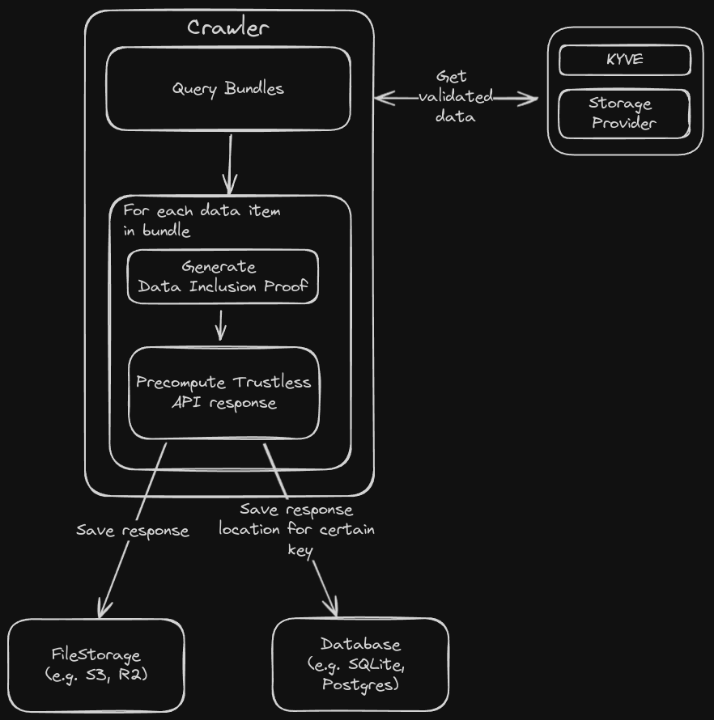
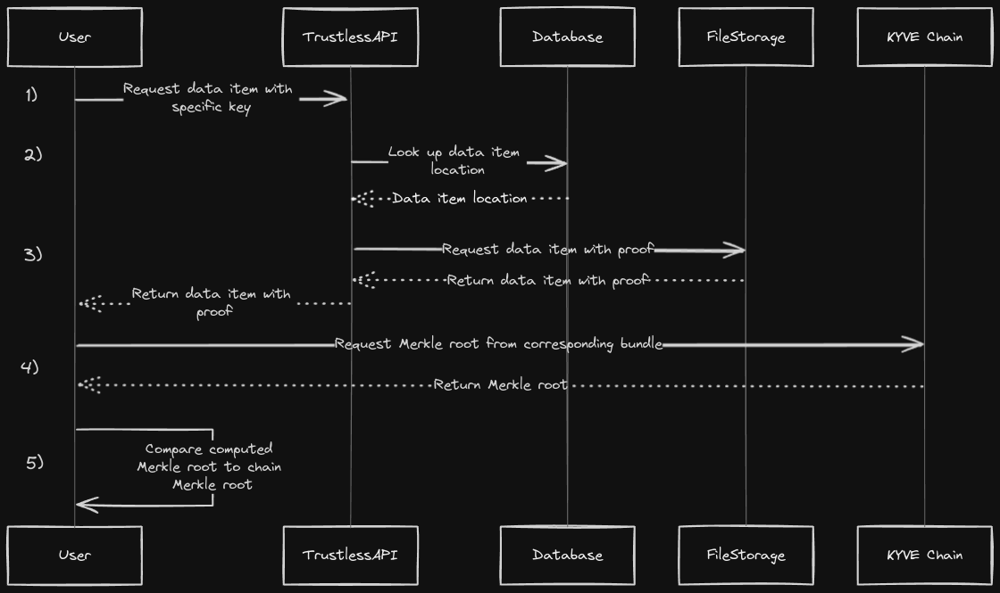

# Trustless API

The trustless Celestia and EVM Blobs API, providing validated data through KYVE.

## Build from Source
```bash
git clone https://github.com/KYVENetwork/trustless-api.git

cd trustless-api

make

cp build/trustless-api ~/go/bin/trustless-api
```
## How to start: 
### Crawler

You can start the crawling process with the following command:

```sh
trustless-api crawler
```

### Server

To serve the crawled data items you have to start the process with the following arguments:

```sh
trustless-api start
```

## Config

The following config serves as an example, utilizing a SQLite database and local storage. You can find the template configuration here: `./config/config.template.yml`

```yml
# log level values: info, warning, debug, error, none
log: info

# === POOLS ===
# An array that defines what pools should be crawled and how they are served.
# - chainid: is the chain id of the pool, e. g. kyve-1, koan-1, korellia-2
# - poolid: respective poolId
# - indexer: defines what indexer to use, the indexer also defines how to access the data
#            e. g. EthBlobs will provide following URLs: "/beacon/blob_sidecars?block_height={block_height}", "/beacon/blob_sidecars?slot_number={slot_number}"
# - slug: what slug should be used when serving the pools. The slug is a unique prefix for each pool when requesting its data.
#         e. g. with the slug 'ethereum' and the indexer EthBlobs the resulting url will be: "/ethereum/beacon/blob_sidecars?..."
# =============
pools:
    - chainid: kaon-1
      indexer: EthBlobs
      poolid: 21
      slug: ethereum
    - chainid: korellia-2
      indexer: Height
      poolid: 105
      slug: linea

# === DATABASE ===
# database configuration
# ================
database:
    # supported databases: sqlite (default), postgres
    type: sqlite 
    # the database name, if you use sqlite this will the the database file. default: ./database.db
    dbname: indexer.db 
    # following attributes are only relevant when using postgres, you don't need them for sqlite
    host: "localhost"
    # IMPORTANT: this is postgres database port, not the port the app will use to serve
    port: 5432 
    user: "admin"
    password: "root"

# === SERVER ===
# server configuration. The server will use the pools config to know what pools to serve
# ==============
server: 
    # port of the server
    port: 4242 

# === SERVER ===
# crawler configuration. Only relevant when running the crawling process
# ==============
crawler:
    # how many threads are used for downloading & processing the bundles
    threads: 4

# === STORAGE ===
# storage configuration.
# ===============
storage:
    # the type of storage to use. available options: local (default), s3
    type: local
    # how many threads are used to save/upload the processed bundle. Default 8
    threads: 8
    # only relevant when using local storage, can be left empty when using AWS
    path: ./data 
    # what compression to use when storing/uploading the data
    # available options: gzip (default), none
    compression: gzip
    
    # S3 CONFIG
    # The following configs are only relevent when using S3

    # your R2 or AWS endpoint
    aws-endpoint: "http://example-bucket.s3-website.us-west-2.amazonaws.com/" 
    # your bucket name
    bucketname: "example-bucket" 
    # CDN where to fetch the data
    cdn: "https://example.domain/" 
    # your access key id and your acces key secret
    credentials:
        keyid: "<access_key_id>" 
        keysecret: "<access_key_secret>"
    # what region to use for the aws config. default: auto
    region: auto 

# === ENDPOINTS ===
# specify custom endpoints & fallback
# endpoints for each storage provider and chain
# if you dont provide any endpoints, official endpoints will be set as default
# =================
endpoints:
    storage:
        1:
            - https://arweave.net
            # define as many fallback endpoints as you want
            # - https://arweave.net
        2:
            - https://arweave.net
        3:
            - https://storage.kyve.network
    chains:
        kaon-1:
            - https://api.kaon.kyve.network
            # same here, define your fallback endpoints
            # - https://api.kaon.kyve.network
        korellia-2:
            - https://api.korellia.kyve.network
        kyve-1:
            - https://api.kyve.network
```

## How it works

The Trustless API is split up into different responsibilities. First, there is the `crawler`, which crawls the actual bundles from KYVE, generates an inclusion proof for each data item in the bundle, creates indices for those data items, and finally stores them together with a proof of inclusion.

Next, there is the server, which receives a request for a data item with a specific key, looks up the data item based on the key, and returns the data item together with the previously generated proof of inclusion.

These steps are independent at the code level, meaning that it is necessary to first start a process with the crawler in order to correctly serve the crawled data items.

### How the crawler works in detail



As previously mentioned, the `crawler` is responsible for retrieving all bundles from the KYVE chain and storing each data item. The crawler process knows which pools to query based on the `config.yml` file provided. You can find a template configuration under `./config/config.template.yml.`

The config file contains all `poolId`s that should be crawled. The crawler itself functions like a master, starting one go-routine per `poolId` that is responsible for crawling that specific `poolId`.

Each go-routine (referred to as a ChildCrawler from here on) performs the following tasks: 
- query missing bundles
- for each data item in the bundle
	-  it generates a data inclusion proof for that specific bundle
 	-  precomputes the Trustless API response
  	-  saves the response
  	-  and saves the response location for certain keys
- repeats that every n-seconds

### Query Bundles

To insert a bundle we first have to retrieve its bundle data.
- first we have to query for that specific bundleId on the KYVE chain, we call this the `finalizedBundle` (the ChildCrawler will use the `chainrest` defined in the config)
- then we have to get the decompressed bundle data associated with the `finalizedBundle` from the given storage provider (the ChildCrawler will use the `storagerest` defined in the config)
- the decompressed bundle data is an array of data items, we compute the hash value of every single data item for the inclusion proof

### Generate Data Inclusion Proof

Now that we have the bundles data items and each corresponding data item hash, we can start generating the trustless data items that contain a proof of inclusion.
We do this by iterating over each data item of the bundle and computing a compact merkle tree for each data item. The compact merkle tree only contains the necessary hashes for constructing the merkle root. This root will be equal to the merkle root stored on the KYVE chain.

### Precompute Trustless API Response

Finally, we can build the response, which will consist of the actual data item and its corresponding inclusion proof. Additionally we need to include relevant information for the user to verify the data items merkle root, like the chainId, poolId and bundleId.

### Save Response & Keys

As a last step, we save/upload all responses to a file storage, like S3, and save the location in the database.

### Indexer
We have to generate indices on each data item because we want to quickly retrieve the trustless data item based on a specific key that corresponse to that exact data item. For each data item, there must be at least one index, but there can be more than one. The crawler will generate indices based on the `indexer` defined in the `config.yml`.

The whole purpose of the Indexer is to return the possible indices of a specific data item, that then will be stored and later queried in the database.

**Example: `EthBlobs`**

The `EthBlobsIndexer` generates all necessary indices to query for blobs:
- block_height
- slot_number

This means, the `EthBlobsIndexer` will take a bundle, which is an array of data items, as an argument and return an array of trustless data items back. A trustless data item contains the actual data, the inclusion proof and all necessary information to verify that proof (like chainId, bundleId). Additionally it contains an array of indicies for that specific data item, these indicies will then be stored in the data base to correctly retrieve the trustless data item later on.

```go
func (e *EthBlobsIndexer) IndexBundle(bundle *types.Bundle) (*[]types.TrustlessDataItem, error) {
	var trustlessItems []types.TrustlessDataItem
	for index, dataitem := range bundle.DataItems {

        	// calculate inclusion proof
        	...

		// calculate indicies
		var indices []types.Index = []types.Index{
			{Index: dataitem.Key, IndexId: IndexBlockHeight},
			{Index: blobData.SlotNumber, IndexId: IndexSlotNumber},
		}

		trustlessDataItem := types.TrustlessDataItem{
			Value:     raw,
			Proof:     proof,
			BundleId:  bundle.BundleId,
			PoolId:    bundle.PoolId,
			ChainId:   bundle.ChainId,
			Indices:   indices,
		}
		trustlessItems = append(trustlessItems, trustlessDataItem)
	}
	return &trustlessItems, nil
}
```

### Database structure & Adapter

How are the data items stored and how do we index them?

We have two schemes:
1. DataItemDocument
2. IndexDocument.

There will be exactly two tables per pool with the following naming conventions: data_items_pool_`poolId`, indices_pool_`poolId` 

**DataItemDocument**
|ID|BundleID|PoolID|FileType|FilePath|
|-|-|-|-|-|
|uint, primary key|int64|int64|int|string|

**IndexDocument**
|Value|IndexID|DataItemID|
|-|-|-|
|string, primary key|int, primary key|uint|

We have to save the index id, because there might be more than one index for a data item e.g. `block_height` & `slot_number`.

We use a database adapter interface to separate the database implementation from our logic. This allows us to switch databases without modifying anything else except the database adapter.

Adapter interface:
```go
type Adapter interface {
	Save(bundle *types.Bundle) error
	Get(indexId int, key string) (files.SavedFile, error)
	GetMissingBundles(lastBundleId int64) []int64
	GetIndexer() indexer.Indexer
}
```

As you can see, we make use of only three methods to interact with the database. When inserting the data items it is important to submit them all with only one transactions, otherwise it might be possible that we fail to save some data items of a bundle resulting in incomplete data.

When saving a bundle, the adapter is responsible for the following:
- convert the bundles data items into trustless data items via. an indexer
- upload/save the trustless data items to a location (this will be done via a FileAdapter, see next chapter)
- write all necessary information about the data item and its location into the database
- and finally insert every index that exists for that specific data item (in case of EthBlobs this would be the `block_height` and `slot_number`)

### File Adapter

The Trustless API can save the trustless data items to various locations, therefore we need to account for different file types. The FileAdapter is responsible for that.

Currently there are only two FileAdapter: 
- local file
- s3 file

A FileAdapter is only responsible for saving a trustless data item. The corresponding interface looks like the following:

```go
type SaveDataItem interface {
	Save(dataitem *types.TrustlessDataItem) (SavedFile, error)
}
```

### How the server works in detail


The crawler has done the difficult part of indexing each bundle, now the server is able to simply retrieve the requested data item from the database.

1. A user requests a specific data item with a key. E. g. the user does the following request: `/beacon/blob_sidecars?block_height=1337`
2. Now the server looksup the data item location for that key. Following our example, the server would call the database adapter with the following arguments: `Get(1337, EthBlobIndexHeight)`
    - `EthBlobIndexHeight = 0` because the block_height is the first index defined in `EthBlobs`
3. Now that we have the data items location, serves the data item directly.
4. At this point the server has provided the user with all the necessariy information to query for the on-chain merkle root for that specific data item.
5. Finally, the user constructs the local merkle root hash based on the provided data item from the server and compares it to the on-chain merkle root.
